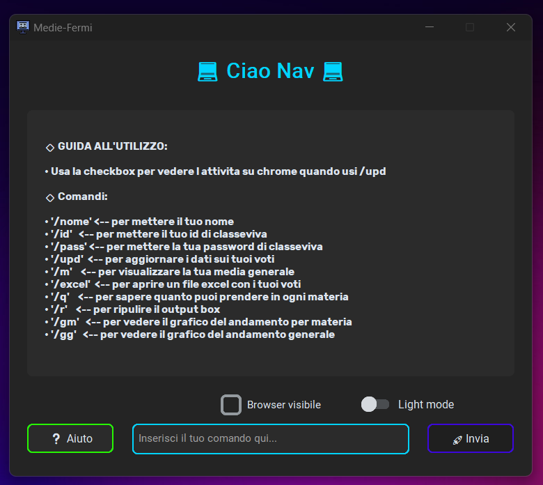

<p align="center">
  
</p>

# 💡Introduzione:

Questa è un app ***dekstop*** disegnata per i studenti che usano ***classeviva*** come registro scolatico , serve a calcolare le medie e fare altre ***operazioni con i voti*** semplicemente loggando con le credenziali di classeviva 


**NB: la app è ancora in sviluppo e potrebbe avere diversi bug** 

## Screenshots & Video

<p align="center">
  
</p>

## Info

Add badges from somewhere like: [shields.io](https://shields.io/)

[](https://choosealicense.com/licenses/mit/)


## ⬇️Installation

- Installa l' app nella ultima [realese](https://github.com/NavCoder-X/Media-fermi/releases)
- decomprimi il file zip
- avvia il file .exe

    
## 💻Avvio locale

Clona il progetto

```bash
  git clone https://github.com/NavCoder-X/Media-fermi
```

vai alla cartella del progetto

```bash
  cd path_progetto
```

Installa le librerie

```bash
  pip install -r requirements.txt
```


## 🔳Features

- 🚗 acesso rapido con classeviva 
- 🔢 calcolo medie esculudendo voti blu/religione/ed civica
- 🔢 calcolo medie future
- 📈 grafici 
- 📂 voti organizzati in un excel
- 🌓 Light/dark mode toggle

## ⏭️UPcoming Features

- 🥇 classifica materie
- 🗃️ report pdf
- 📊 dashboard

## 🔗 Links & Support
[](https://discord.com/users/stranger8275)
[](https://github.com/NavCoder-X) 
[](htttps://www.instagram.com/jottasaini?igsh=b3hvbnZ2Zzgwemhz)

## <p align="center">  </p>

<h1 align="center">Grazie🩷</h1>
